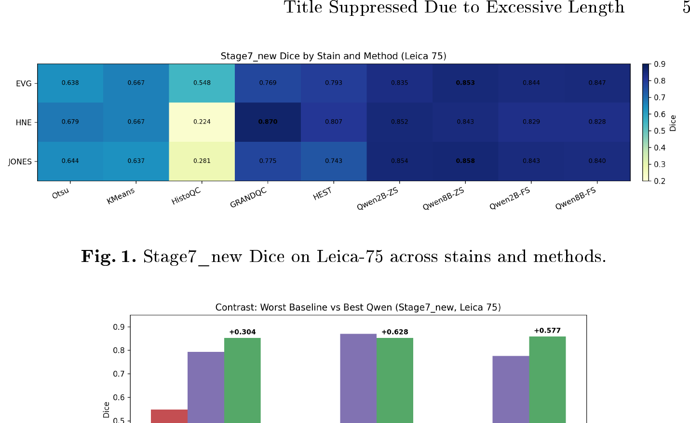

# WSI Foreground Segmentation + VLM Reviewer

This repository contains a minimal codebase for:

1. Foreground tissue segmentation in whole slide images (WSI)
2. Reviewer-based quality control over Stage 3 segmentation outputs

## Method Figure (Figure 1)



Rendered Figure 1 is extracted directly from the paper PDF. Raw panel assets are available in `docs/figures/figure1_pipeline/`.

## Canonical Entry Points

- Foreground method: `run_foreground_pipeline.py`
- Reviewer batch runner: `run_vlm_reviewer_batch.py`

For reproducible runs, use the wrapper scripts:

- `bash scripts/run_paper_foreground.sh`
- `bash scripts/run_paper_reviewer.sh`

## Quickstart

1. Create/sync the conda environment (defaults to env name `path-agent`):

```bash
bash setup.sh
```

2. Fill args templates for your environment:
- `configs/paper_foreground.args`
- `configs/paper_reviewer.args`

3. Run foreground segmentation:

```bash
bash scripts/run_paper_foreground.sh
```

4. Run reviewer QC:

```bash
bash scripts/run_paper_reviewer.sh
```

Direct reviewer CLI examples:

```bash
# Batch reviewer over method outputs
python run_vlm_reviewer_batch.py \
  --baseline-dir runs/foreground \
  --output-root runs/reviewer \
  --batch-name reviewer_batch_v1 \
  --model google/gemini-3.1-pro-preview \
  --thinking-level High \
  --no-include-thoughts \
  --max-tokens 12000

# Single-item reviewer (objective prompt)
python vlm_reviewer.py \
  --crop /path/to/crop.png \
  --mask /path/to/mask.png \
  --prompt-file prompts/objective_reviewer.txt \
  --backend gemini \
  --model gemini-3.1-pro \
  --thinking-level High \
  --no-include-thoughts \
  --max-tokens 12000
```

## Accuracy Recommendations

- If you plan to run reviewer QC on method overlays, enable `--stage2-force-read-l0` in foreground runs.
- This is especially important when using auto-context (`--stage6-icl-k > 0`) so downstream overlays and point grounding are done over higher-resolution bbox crops instead of thumbnail-derived crops.
- Stage 1 grounding quality note: Qwen grounding is generally weaker than Gemini models for bbox detection coverage.
- Stage 1 price/performance recommendation: `google/gemini-3-flash-preview` is typically the strongest cost-quality choice.
- Qwen Stage 1 outputs are still usable for student distillation: sampled FG/BG patches from detected tissue-core regions still provide a valid training set.
- Stage 5 reranking recommendation: prefer Gemini 3.1 Pro for best quality; use Flash when cost/latency is the priority. For Gemini backends, keep `--stage5-gemini-thinking-level High`.
- Reviewer recommendation: prefer Gemini 3.1 Pro with thinking high; in `vlm_reviewer.py`, `--thinking-level High` is already the default.

Example foreground command pattern:

```bash
python run_foreground_pipeline.py \
  --wsi /path/to/case.svs \
  --output-root runs/foreground \
  --skip-stage2 \
  --stage2-force-read-l0 \
  --stage1-backend vllm \
  --stage1-model Qwen/Qwen3-VL-8B-Instruct \
  --stage5-vlm-backend gemini \
  --stage5-vlm-model gemini-3.1-pro \
  --stage5-gemini-thinking-level High
```

## Expected Runtime Inputs

- A local WSI path (`.svs`, `.ndpi`, `.isyntax`, etc.)
- Model/backend credentials via environment variables (or explicit CLI flags)
- Stage 3/foreground outputs when running reviewer mode

## Main Output Roots

- Foreground method: under your chosen output root (for example `runs/foreground/`)
- Reviewer batch: under your chosen output root (for example `runs/reviewer/`)

See `docs/stage_outputs.md` for stage-level output contracts.

## Documentation

- `docs/installation.md`: conda + requirements setup
- `docs/scripts.md`: CLI map for kept scripts
- `docs/foreground_pipeline.md`: stage-by-stage method logic
- `docs/reviewer.md`: reviewer inputs/outputs and JSON schema
- `docs/stage_outputs.md`: output directory/file semantics
